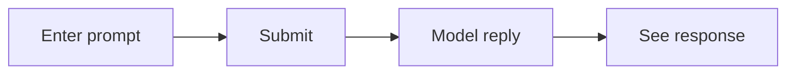

# Python AI Starter Template

Minimal Streamlit app for quick prototypes: a prompt box and response area, calling the OpenAI Chat Completions API with **in-process caching** of identical prompts (`st.cache_data`).

**Requirements:** Python **3.10+** (see `pyproject.toml`).

## App flow



Repeated identical prompts skip a new API call thanks to `st.cache_data` (see above).

## Setup

```bash
python3 -m venv .venv
source .venv/bin/activate          # Windows: .venv\Scripts\activate
pip install -e .
```

Copy the example env file and add your key:

```bash
cp .env.example .env
```

Edit `.env` and set at least **`OPENAI_API_KEY`**. The app loads these values with [python-dotenv](https://pypi.org/project/python-dotenv/) (`load_dotenv()` in `app.py`).

## Run

```bash
streamlit run app.py
```

Open the URL Streamlit prints (usually http://localhost:8501).

## Configuration

| Variable | Required | Description |
|----------|----------|-------------|
| `OPENAI_API_KEY` | **Yes** | API key from [OpenAI API keys](https://platform.openai.com/api-keys). Without it, the app raises a clear error at submit time. |
| `OPENAI_MODEL` | No | Model id for chat completions (default: `gpt-4o-mini`). |
| `APP_TITLE` | No | Browser tab title and main heading (default matches `.env.example`). |

See `.env.example` for placeholders and comments.

### Local vs hosted

- **Local:** use `.env` in the project root (gitignored). Do not commit real keys.
- **Hosted:** `app.py` reads settings with **`os.getenv`** (after `load_dotenv()`). Your platform must supply **`OPENAI_API_KEY`** (and optional vars) as **process environment variables**, or map [Streamlit secrets](https://docs.streamlit.io/develop/concepts/connections/secrets-management) to env in the deployment UI. If your host only exposes `st.secrets` and not env, add a small bridge in `app.py` or use the host’s recommended env injection.
